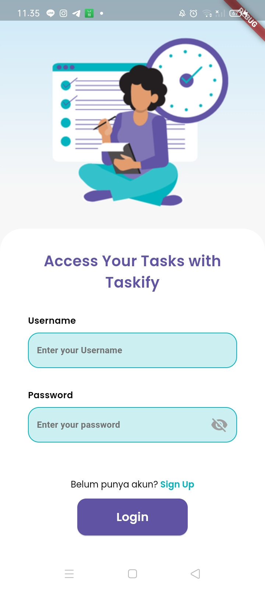
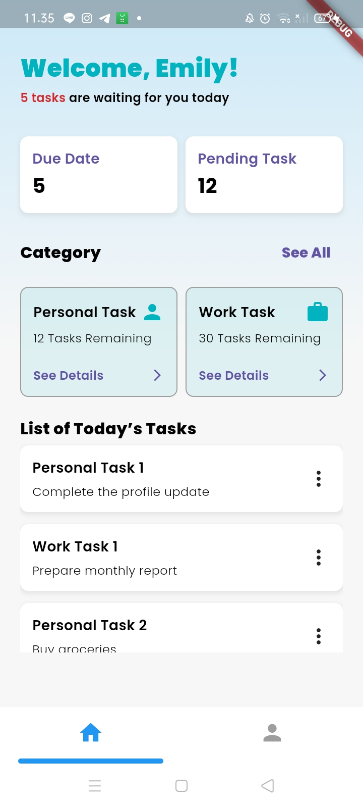
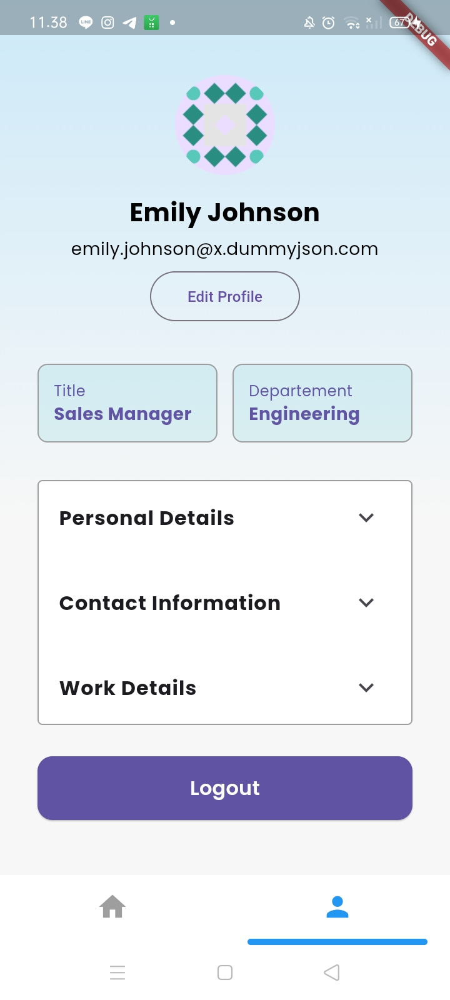

# app_mobile_79

# Instalasi

1. Pastikan sudah terinstall Flutter SDK: 
   - Flutter Installation Guide
2. Clone repository: 
   - git clone <URL_REPOSITORY> 
   - cd taskify
4. Install dependencies: 
   - flutter pub get
5. Jalankan aplikasi: 
   - flutter run

For help getting started with Flutter development, view the
[online documentation](https://docs.flutter.dev/), which offers tutorials,
samples, guidance on mobile development, and a full API reference.
