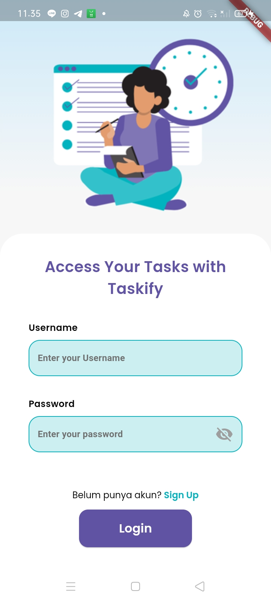
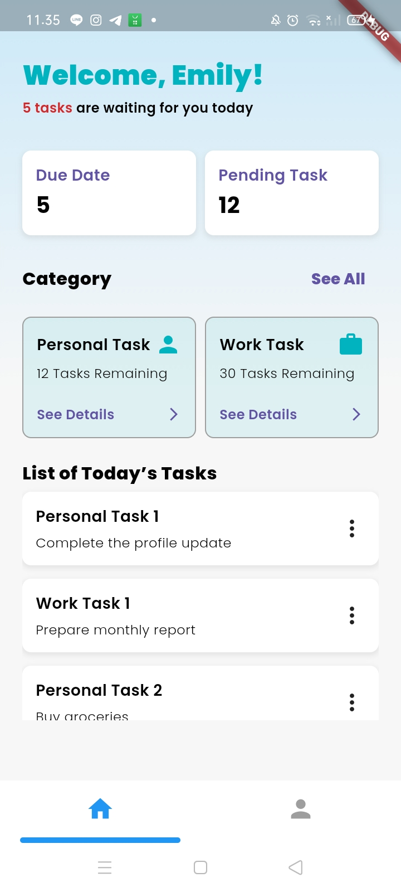

# app_mobile_79

# Instalasi

1. Pastikan sudah terinstall Flutter SDK:
   -- Flutter Installation Guide
2. Clone repository:
   -- git clone <URL_REPOSITORY>
   -- cd taskify
3. Install dependencies:
   -- flutter pub get
4. Jalankan aplikasi:
   --flutter run

For help getting started with Flutter development, view the
[online documentation](https://docs.flutter.dev/), which offers tutorials,
samples, guidance on mobile development, and a full API reference.
